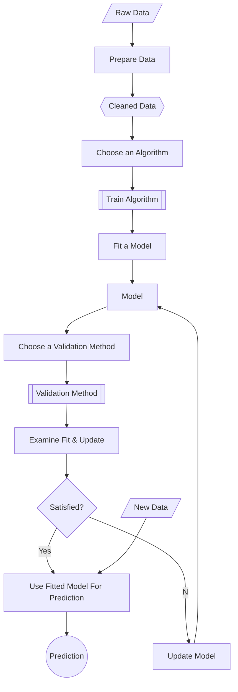

# Basic Machine Learning Workflow

```mermaid
flowchart TB
    raw_data[/Raw Data/] 
    --> prep_data[Prepare Data]
    --> cleaned_data{{Cleaned Data}}
    --> choose_algo[Choose an Algorithm]
    --> train_algo[[Train Algorithm]]
    --> fit_model[Fit a Model]
    --> model[Model]
    --> choose_validation_method[Choose a Validation Method]
    --> validation_method[[Validation Method]]
    --> exam_fit_update[Examine Fit & Update]
    --> satisfied{Satisfied?}    
    --Yes--> fitted_model[Use Fitted Model For Prediction]    
    -->prediction((Prediction))
    satisfied--No--> update_model[Update Model]-->model
    new_data[/New Data/]-->fitted_model

```